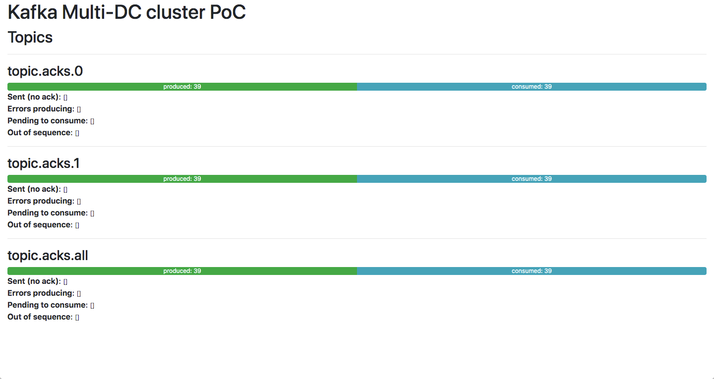
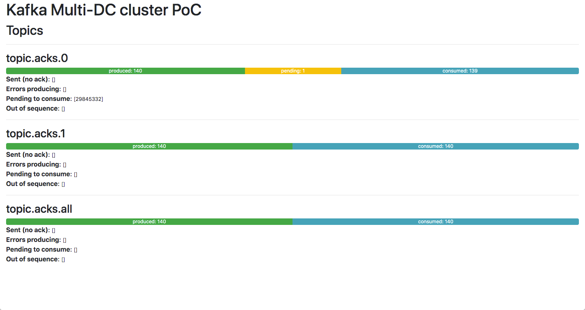
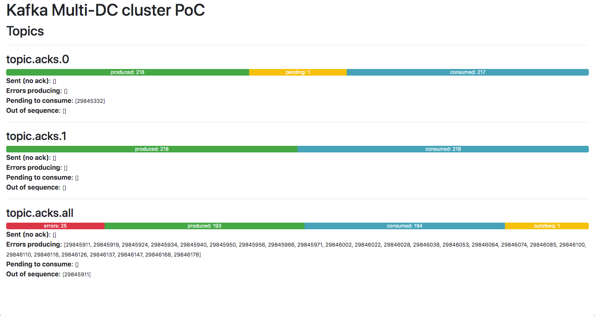

# kafka-multidc-poc

Proof of Concept to test different configurations of Kafka producer acks (all, 1, 0)
in a multi-broker, multi-DC environment with replication > 1 and in-sync replicas > 1.

## Proof of Concept

The PoC is a Spring Boot Java app running in [docker](https://www.docker.com/)
along with a simulated multi-DC Kafka cluster.

The Java app starts 3 producers with different configurations of acks: all,1, 0.
A new message is generated every 5 seconds containing a number
that increases with each message and sent to 3 different topics:

* `topic.acks.all`
* `topic.acks.1`
* `topic.acks.0`

The Java app also starts 3 consumers (one per each topic) and stores the statistics
of what is happening in each topic:

* Messages sent to the topic but ack not received yet.
* Messages successfully produced.
* Messages produced but not consumed yet.
* Messages successfully consumed.
* Messages consumed but not produced (ack not received).
* Messages that were impossible to send to the topic.

## PoC configuration

The `docker` folder contains a configuration to run a Kafka cluster with
5 Kafka brokers and 3 Zookeeper servers, all based in the
[`blacktop/kafka:2.6`](https://hub.docker.com/r/blacktop/kafka)
docker image.

The testing Kafka cluster is composed of:

* **3 Zookeeper servers**:
    * `kpoc_zookeeper1`
    * `kpoc_zookeeper2`
    * `kpoc_zookeeper3`
* **5 Kafka brokers** splited in **2 datacenters**:
    * `dc1`
        * `kpoc_broker1`
        * `kpoc_broker3`
        * `kpoc_broker5`
    * `dc2`
        * `kpoc_broker2`
        * `kpoc_broker4`

Every broker of the cluster is configured with:

* `num.partitions` = 7
* `min.insync.replicas` = 2
* `default.replication.factor` = 4
* `offsets.topic.replication.factor` = 4
* `auto.crete.topics.enable` = false

Running the cluster creates 3 topics:

* `topic.acks.all`
* `topic.acks.1`
* `topic.acks.0`

There are some `bash` script to help running and accessing the containers:

* `docker/docker-compose-up.sh` - runs the Kafka cluster.

* `docker/docker-compose-down.sh` - stops the Kafka cluster.

* `docker-kafka-topics-list.sh` - lists all the topics in the cluster.

    ```bash
    $ docker/docker-kafka-topics-list.sh
    Listing all the topics in the cluster...
    Usage:
        docker/docker-kafka-topics-list.sh [BROKER]
    
    topic.acks.0
    topic.acks.1
    topic.acks.all
    ```

* `docker-kafka-topics-describe.sh` - Describes one topic.

    ```bash
    $ docker/docker-kafka-topics-describe.sh topic.acks.all
    This script describes a topic.
    Usage:
        docker/docker-kafka-topics-describe.sh TOPIC [BROKER]
    
    Describing the topic topic.acks.all...
    
    Topic: topic.acks.all	PartitionCount: 7	ReplicationFactor: 4	Configs: min.insync.replicas=2,segment.bytes=1073741824
        Topic: topic.acks.all	Partition: 0	Leader: 3	Replicas: 3,2,4,5	Isr: 3,2,4,5
        Topic: topic.acks.all	Partition: 1	Leader: 4	Replicas: 4,3,5,1	Isr: 4,3,5,1
        Topic: topic.acks.all	Partition: 2	Leader: 5	Replicas: 5,4,1,2	Isr: 5,4,1,2
        Topic: topic.acks.all	Partition: 3	Leader: 1	Replicas: 1,4,5,2	Isr: 1,4,5,2
        Topic: topic.acks.all	Partition: 4	Leader: 2	Replicas: 2,5,1,3	Isr: 2,5,1,3
        Topic: topic.acks.all	Partition: 5	Leader: 3	Replicas: 3,4,5,1	Isr: 3,4,5,1
        Topic: topic.acks.all	Partition: 6	Leader: 4	Replicas: 4,5,1,2	Isr: 4,5,1,2
    ```

## Running the PoC

1.- Compile the Java app:

```bash
$ cd kafka-multidc-poc
$ ./gradlew build
```

2.- Run the docker-compose configuration

```bash
$ docker/docker-compose-up.sh --extra
```

3.- Wait util all the containers are created and initialized.
This step could take some minutes.

4.- Open the web browser a go to `http://localhost:8080/topics`.
You will see in almost real time how the producer sends messages to the topics
and how the consumers read the messages.



5.- Stop all the brokers in `dc2`:

```bash
$ docker stop kpoc_broker2 kpoc_broker4
```

At this point everything should continue working well for `topic.acks.all`
since there are enough in-sync replicas to continue running.

However `topic.acks.0` could have lost a message since no the producer is
not waiting for any confirmation.



You should enable again the brokers on `dc2` before continue and wait
until all the messages are replicated to those brokers.

```bash
$ docker start kpoc_broker2 kpoc_broker4
```

6.- Stop all the brokers in `dc1`:

```bash
$ docker stop kpoc_broker1 kpoc_broker3 kpoc_broker5
```

At this point the producer of `topic.acks.all` will start being unable to send
messages to Kafka for some partitions because there will be not enough in-sync
replicas.

```bash
$ docker exec -t kpoc_broker2 kafka-topics.sh --bootstrap-server=localhost:9092 --describe --topic topic.acks.all

Topic: topic.acks.all	PartitionCount: 7	ReplicationFactor: 4	Configs: min.insync.replicas=2,segment.bytes=1073741824
	Topic: topic.acks.all	Partition: 0	Leader: 2	Replicas: 3,2,4,5	Isr: 2,4
	Topic: topic.acks.all	Partition: 1	Leader: 4	Replicas: 4,3,5,1	Isr: 4
	Topic: topic.acks.all	Partition: 2	Leader: 4	Replicas: 5,4,1,2	Isr: 2,4
	Topic: topic.acks.all	Partition: 3	Leader: 4	Replicas: 1,4,5,2	Isr: 2,4
	Topic: topic.acks.all	Partition: 4	Leader: 2	Replicas: 2,5,1,3	Isr: 2
	Topic: topic.acks.all	Partition: 5	Leader: 4	Replicas: 3,4,5,1	Isr: 4
	Topic: topic.acks.all	Partition: 6	Leader: 4	Replicas: 4,5,1,2	Isr: 2,4
```



# Links

* [blacktop/kafka at Dockerhub](https://hub.docker.com/r/blacktop/kafka).
* [blacktop/kafka at Github](https://github.com/blacktop/docker-kafka-alpine).
* [Apache Kafka documentation](https://kafka.apache.org/documentation/).
* [ZooKeeper documentation](https://zookeeper.apache.org/doc/r3.6.2/).
* [Dockerfile reference](https://docs.docker.com/engine/reference/builder/).
* [Docker compose file reference](https://docs.docker.com/compose/compose-file/).
* [Kafka and Zookeeper MultiNode Cluster Setup](https://medium.com/@kiranps11/kafka-and-zookeeper-multinode-cluster-setup-3511aef4a505).
* [The Foundations of Multi-DC Kafka](https://www.confluent.io/kafka-summit-lon19/foundations-of-multi-dc-kafka/), video.
